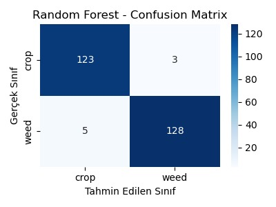
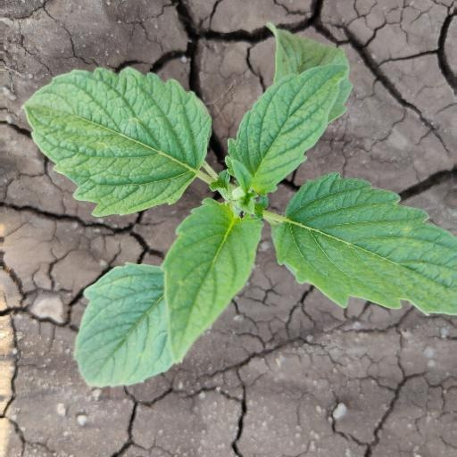
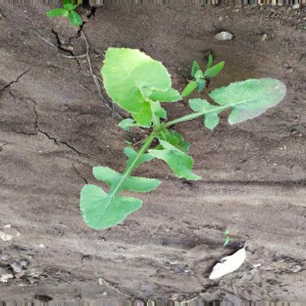

# Crop–Weed Classification using Classical Image Processing and Machine Learning

This project focuses on classifying crop and weed images using
classical image processing and machine learning techniques.

## Overview
The goal of this study is to distinguish crops from weeds in agricultural images
by extracting hand-crafted features and applying traditional machine learning classifiers.

No deep learning methods are used in this project.

## Feature Extraction
The following features are extracted from each image:
- Color features in HSV color space
- Contour-based features
- Texture features using GLCM
- Edge and gradient features using HOG

## Models
The following machine learning models are evaluated:
- Random Forest
- Support Vector Machine (RBF kernel)
- Logistic Regression
- Gradient Boosting

## Evaluation
- Train/Test split is used
- 5-fold cross-validation is applied for Random Forest
- Confusion matrices are visualized
- Misclassified samples are saved for further inspection

The best performance is achieved using the Random Forest model with approximately **97% accuracy**.

## Visualization

### Confusion Matrix (Random Forest)


### Misclassified Samples

**Weed classified as Crop**  


**Crop classified as Weed**  


## Dataset
The dataset is expected to have the following structure:

```text
dataset_final/
├── train/
│   ├── crop/
│   └── weed/
└── test/
    ├── crop/
    └── weed/
The dataset path can be specified using the DATASET_PATH environment variable.

Output
Misclassified samples from the Random Forest model are saved in the
misclassified_examples/ directory.

How to Run
python main.py
Make sure the dataset path is correctly set before running the script.
If the dataset is not located in the project directory, set the path using the
DATASET_PATH environment variable.

